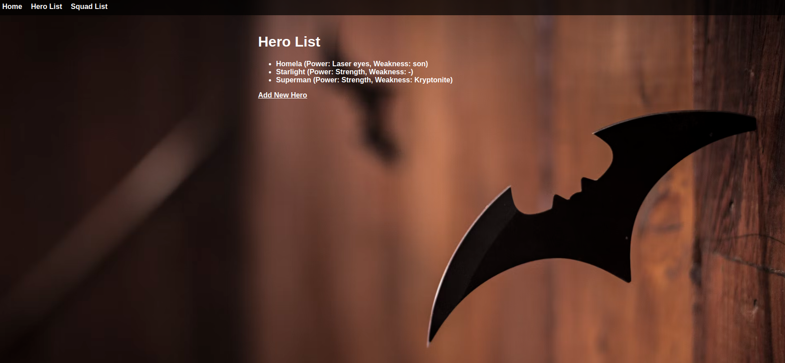
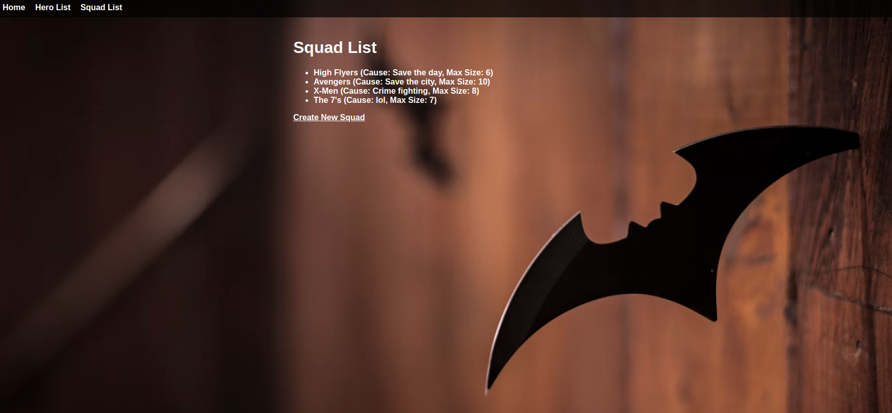

## Project Name

Hero Squad

## 🔭 Project Description

An app that allows you to recruit a well-balanced team of superheroes

## 👷 Author

Sophia Chisiya

## 🔨 Setup Instructions
- git clone https://github.com/totalSophie/ip-week-five
- Open the cloned folder in VS Code
- Go live

## 😎 Live Link
https://totalsophie.github.io/ip-week-five/

## 💻 Technologies Used
- Java

## 📷 Screenshots of the site

## 👨‍💻 Contact
- totalsophie@gmail.com

## License
